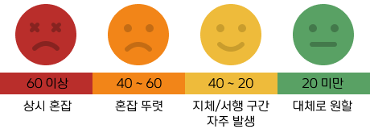

# 서울시 교통 혼잡도 인덱스 : 자치구별 차량 밀도와 혼잡도 통계

# 📊 Seoul Way라노

**서울시 도로(링크) 단위 평균속도(혼잡도)와 자치구 차량 등록 현황을 DB로 통합**하고,
**FAQ(교통/혼잡 관련)를 크롤링하여 정보 제공 기능을 보강**한 데이터 기반 서비스이다.

---

## 📅 프로젝트 기간
- 2026.01.16(금) ~ 2026.01.19(월)
- 총 2일

---

## 1. 팀 소개

### 1-1. 팀명
Young People

### 1-2. 팀원 구성 및 GitHub

| 이름 | 역할 | GitHub |
|----|----|----|
| 김규호 | DB생성 및 적재 파이프라인 구축 | [https://github.com/kyu5KIm](https://github.com/kyu5KIm) |
| 김지원 | FAQ 데이터 크롤링 및 테이블 설계 | [https://github.com/edu-ai-jiwon](https://github.com/edu-ai-jiwon) |
| 류지우 | streamlit 개발 및 DB연동  | [https://github.com/jia11234](https://github.com/jia11234) |
| 박수영 | DB생성 및 FAQ 크롤링 | [https://github.com/suyoung6279](https://github.com/suyoung6279) |

---

## 2. 프로젝트 개요

### 2-1. 프로젝트 명
**Seoul Way**
서울시 자치구별 차량 등록 규모 대비 교통혼잡(월별) 퍼센티지 통계 사이트

### 2-2. 배경

서울시 「2025년도 도로통계」에 따르면 서울의 도로 총연장은 최근 몇 년간 전반적으로 증가해 2024년 기준 8,343km 수준으로 집계됩니다. 도로가 늘어 실제로 혼잡이 줄어들었는지 확인해보기 위해 저희는 서울 내 승용차 통행속도를 보았습니다.

저희의 예상과 다르게 서울 내 승용차 통행속도는 최근 몇 년간 하락 추세를 보이며, “도로는 늘어나는데도 소통은 개선되지 않는” 현상이 관측됩니다. 또한 서울 열린데이터광장 자료를 기준으로 등록 차량 대수는 최근 몇 년간 큰 폭의 급증이라기보다는 완만한 변동 수준으로 나타나, 혼잡을 단순히 “차가 갑자기 늘어서”라고만 보기에도 한계가 있습니다.

저희는 이 현상의 원인을 더 구조적으로 보기 위해, 자치구별로 ‘도로 공급(도로 연장)’ 대비 ‘차량 보유(등록대수)’가 얼마나 밀집되어 있는지에 주목했습니다. 같은 서울 안에서도 자치구마다 도로망 규모가 다르고 등록 차량 규모도 다르기 때문에, 일부 자치구는 도로 1km당 등록 차량 밀도가 높아 ‘수요 대비 공급’이 불균형할 수 있습니다.

따라서 본 프로젝트는 자치구별 혼잡 퍼센티지(기준속도 대비 속도저하율)와 도로 1km당 등록 차량 밀도를 함께 제시하여, 단순 속도 비교나 단순 차량 대수 비교를 넘어 어느 자치구가 구조적으로 혼잡에 취약한지를 직관적으로 파악할 수 있는 통계 지표를 제공하고자 합니다.

### 2-3. 프로젝트 소개
본 프로젝트는 서울시 25개 자치구를 대상으로
차량 등록 규모와 주요도로 월평균속도를 결합해
**월별 교통 혼잡 퍼센티지 통계**를 제공하는 데이터 기반 웹 서비스이다.
자치구 단위에서 상시적인 혼잡 성향과 월별 변화 추세를 비교할 수 있도록
주요도로 중심의 속도 집계와 도로종류별 기준속도를 적용해
**기준 대비 속도저하율(혼잡 퍼센티지)** 로 표준화하였다.

추가로 서울시설공단 FAQ 중 ‘혼잡/교통’ 관련문항을 크롤링하여(총 27개) DB에 적재함으로써 사용자 정보 탐색 기능을 보완하였다.

### 2-4. 프로젝트 기간

**프로젝트 기간:  2025.01.16 ~ 2025.01.19**

## 2-5. 프로젝트 필요성(배경)

- 교통 혼잡을 제대로 비교하려면 평균속도, 도로종류/제한속도, 도로 길이, 자치구별 차량 등록대수가 함께 필요하지만, 데이터가 서로 다른 형태로 분산되어 있어 한 번에 분석하기 어렵다.
- 기존 서비스는 주로 실시간 지도 또는 도로/구간 단위 속도 제공에 집중되어 있어, 사용자가 궁금해하는 자치구(생활권) 단위의 월간 혼잡 성향을 한눈에 비교하기 어렵다.
- 따라서 본 프로젝트는 위 데이터를 관계형 DB로 통합하고, 자치구별 혼잡 퍼센티지(월별)와 비교 통계를 제공한다.
- 추가로 FAQ를 함께 제공해, 지표와 결과를 사용자가 쉽게 이해하고 해석할 수 있도록 한다.

## 2-6. 프로젝트 목표

- 서울시 자치구별 차량 밀도, 주요도로 월평균속도 데이터를 통합해 한 화면에서 보여준다.
- 도로종류별 기준속도를 적용해 혼잡 퍼센티지(속도저하율)를 산출하고, 자치구 간 비교가 가능하도록 표준화한다.
- 월별 통계를 제공해 자치구별 혼잡의 변화 추세를 확인할 수 있게 한다.
- 1km당 등록 차량 밀도(차량/도로km)를 함께 계산해, 도로 공급 대비 차량 수요가 높은 혼잡 취약 자치구를 식별한다.
- 결과 지표를 정책·운영·서비스 기획(우선순위 설정, 지역 특성 분석 등)에 활용할 수 있는 형태로 제공한다.
- 교통/혼잡 관련 FAQ 조회 기능을 제공해 사용자의 정보 탐색을 돕는다.

## 2-7. **주요 타겟 사용자**

- 서울 생활권(거주·방문·통근) 의사결정을 하는 일반 이용자 및 사회초년생
- 서울시 및 자치구의 교통 운영·민원 대응·투자 담당자
- 모빌리티/렌터카/물류 기업의 전략 담당자
---

## 3.기술 스택
- Python (requests, BeautifulSoup, mysql-connector)
- MySQL
- Streamlit
- Figma

---

## 4. WBS

프로젝트 전체 일정 및 작업 단계를 WBS 기반으로 관리하였다.

---

## 5. 요구사항 명세서

| ID | 요구사항 | 구현 여부 | 비고 |
|----|----|----|----|
| R1 | 교통 DB 생성 및 테이블 구축 | 완료 | DB 생성 및 스키마 확정 |
| R2 | 도로 정보 저장 (`tbl_road`) | 완료 | PK 설계 |
| R3 | 제한속도 저장 | 완료 | FK 연결 |
| R4 | 혼잡도 저장 | 완료 | 평균속도 컬럼 |
| R5 | 차량 등록 현황 | 완료 | 복합 PK |
| R6 | FAQ 크롤링 | 완료 | 총 27건 |

---
## 6. ERD
### 6-1. DA 모델(ERD)

본 프로젝트의 ERD는 도로(링크) 엔터티를 중심으로
제한속도 / 혼잡도 데이터가 연결되며,
자치구(권역구분) 기반 차량 등록 현황과
FAQ 테이블을 별도로 구성하였다.

1️⃣ 도로(tbl_road): road_id(PK), registered_region, 도로명/시점/종점/방향

2️⃣ 제한속도(tbl_speed_limit): road_code(FK → tbl_road.road_id), 제한속도

3️⃣ 혼잡도(tbl_congestion): road_code(FK), date_id, average_speed
-PK: (road_code, date_id)

4️⃣ 구별차량현황(tbl_registered_car):
-PK: (registered_region, registered_month)

5️⃣ FAQ(tbl_faq): faq_id(PK), faq_title, faq_contents, faq_section

---

## 7. 수행결과 (시연 페이지)
### 7-1-1. FAQ 크롤링 및 DB 적재 결과

- 크롤링 대상: 서울시설공단 교통 FAQ
- 크롤링 키워드: 혼잡/ 교통
- 최종 적재 개수: 총 27개
- 적재 테이블: `tbl_faq`

### 7-1-2. 차량 등록대수 데이터 DB 적재 결과

- 데이터 출처: 서울시 월별 차량 등록대수 엑셀(`car_month.xlsx`)
- 처리 내용: 월별(24개월) · 지역별(24개 구) 차량 등록대수 파싱
- 전처리 사항: 총계() 값 제거 및 결측치 처리
- 최종 적재 개수: 총 576건 (24개월 × 24개 지역)
- 적재 테이블: `tbl_registed_car`

### 7-1-3. 도로 기본 정보 DB 적재 결과

- 데이터 출처: 서울시 월별 차량통행속도 데이터(`서울시 차량통행속도.xlsx`)
- 처리 내용: 도로 메타데이터(도로명, 거리, 시·종점, 방향, 권역) 추출
- 키 설계: `road_id = 링크아이디 + 연/월 suffix`
- 중복 처리: `ON DUPLICATE KEY UPDATE` 적용
- 최종 적재 개수: 월별 도로 데이터 자동 적재
- 적재 테이블: `tbl_road`

### 7-2 지표 산출 방식(혼잡 퍼센티지 계산 로직)

본 서비스의 핵심 지표는 “혼잡 퍼센티지(속도저하율)”이며, 월별로 다음 순서로 계산한다.

1. **도로별 속도비율 계산**
- 각 주요도로에 대해 `속도비율 = 월평균속도 ÷ 도로종류별 기준속도` 를 계산한다.
- 도로종류별 기준속도는 비교의 일관성을 위해 사전에 정의한다(예: 도시고속 100km/h, 주/보조간선 50km/h).
1. **혼잡 퍼센티지(%)로 변환**
- `자치구 혼잡률(%) = (1 − 자치구 속도비율) × 100`
- 값이 높을수록 기준 대비 속도저하가 크며, 혼잡이 심한 것으로 해석한다.
1. **차량 등록 밀도 산출**
- 교통 수요 압력을 반영하기 위해 자치구별 차량 밀도를 산출한다.
- 차량 등록 밀도는 다음과 같이 정의한다.
- 차량 등록 밀도 = `자치구 차량 등록대수 ÷ 자치구의 모든 도로 길이`
- 단위는 대/km

※ 차량 등록대수는 혼잡 퍼센티지 산출에는 직접 사용하지 않고, 보조 지표 계산에 활용한다.

1. **차량정규화 혼잡 지수 산출(보조 지표)**
- 혼잡 퍼센티지를 차량 보유 규모로 정규화하기 위해 차량 정규화 혼잡지수를 산출한다.
- 계산 식은 다음과 같다.
- `차량정규화 혼잡지수 =  차량 등록 밀도 × (혼잡률 ÷ 100)`
- 본 지표는 차량 보유 규모 대비 혼잡 수준을 상대적으로 비교하기 위한 보조 지표이다.

※ 본 지표는 절대적 혼잡 수준 판단이 아닌,  자치구 간 혼잡 효율성·구조적 차이 비교를 목적으로 활용한다.

1. **결측/오류값 처리 정책**
- 본 데이터에서는 월평균속도 0값이 관측되지 않아, 0값(결측/오류) 처리 규칙은 분석 범위에서 제외하였다.
- 치량 등록 밀도 산출 시 도로 길이가 0으로 산성되는 경우는 분석 대상에서 제외한다.
1. **혼잡 퍼센티지 해석 가이드(예시)**

2. **차량정규화 혼잡지수**
- 값이 높을수록 차량 보유 규모 대비 혼잡이 과도함
- 값이 낮을수록 차량 수 대비 도로 운영 효율이 양호함

→ 기준이 없는 이유: 서비스 목적에 맞게 상대 비교용으로 정의한다.

---

## 8. 한 줄 회고

- 김규호: 월별로구조가 다른 대용량 데이터를 DB에 적재하는 과정에서, 작은 오류도 전체 작업에 영향을 줄 수 있어 코드를 정확하게 작성하는 것의 중요성을 느꼈다. 또한 엑셀 기반 교통 데이터를 직접 분석하며 데이터 전처리, DB 설계, 적재, 에러 처리까지 전 과정을 경험했고, 단순 구현을 넘어 재실행 가능한 데이터 파이프라인의 필요성을 배울 수 있었다.  
or
월별로 구조가 다른 대용량 교통 데이터를 DB에 적재하며 데이터 전처리부터 설계·에러 처리까지 경험했고, 정확한 코드 작성과 재실행 가능한 데이터 파이프라인의 중요성을 배울 수 있었다.
    
    
- 김지원: FAQ 데이터를 크롤링하는 과정에서 적절한 키워드 선정과 HTML 구조 이해에 어려움을 겪었으며, BeautifulSoup selector 문법과 반복문을 통한 텍스트 추출 방식을 팀원 질문과 시행착오를 통해 점진적으로 이해하게 되었다.

- 류지우: Streamlit과 데이터베이스를 연동하여 교통 혼잡도를 계산하는 과정에서 복잡한 SQL 쿼리문을 작성하는 데 어려움을 겪었다. 이를 해결하기 위해 DB를 분석하며 쿼리문을 작성함으로써, 데이터 계산을 효율적으로 처리하는 능력을 키울 수 있었다. 또한 Streamlit을 활용해 사용자에게 직관적인 그래프와 화면을 구성하고, 자치구별 버튼을 하나하나 배치하는 과정을 통해 UI 구성 능력도 향상시킬 수 있었다.

- 박수영: ERD를 설계하는 과정에서 테이블 간의 연결하는 키들을 설정하고 어떤 PK를 주어야 다른 테이블에서 오류가 나지 않는지 고민하는 과정에 상당한 시간이 소요되었다. 또한 데이터를 SQL에 입력하는 과정에서 같은 형식의 다른 데이터가 들어와도 같은 결과가 나와야 한다는 것에 노력이 필요하다는 것을 깨달았다. 프로젝트를 하면서, 크롤링과 git 협업을 어느정도 이해하였다.
